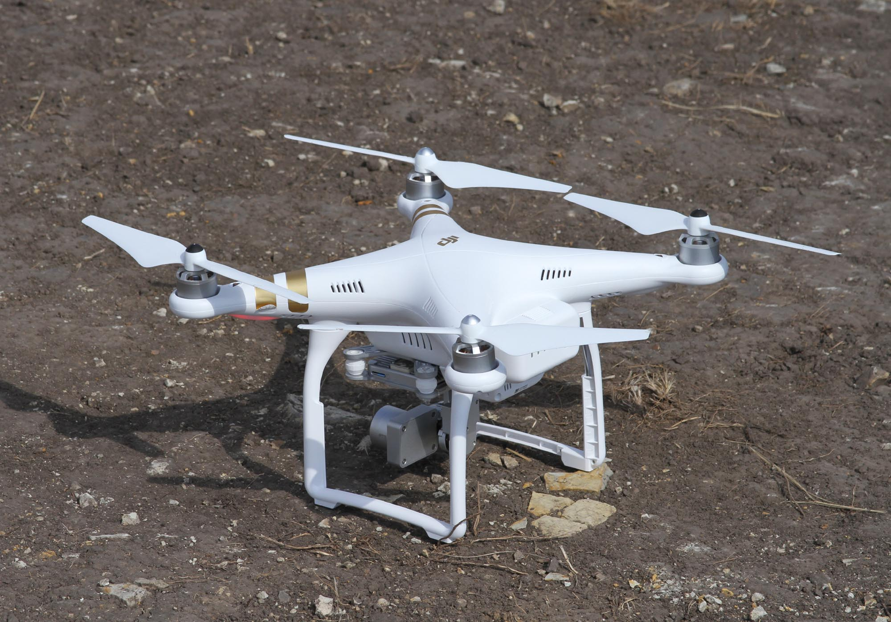

# ARob-winter

## What this course is about

Aeronaves Robotizadas / Unmanned Aerial Vehicles (UAVs), MEAer, Instituto Superior Técnico.
At its core, the course teaches how to build the full control loop of a quadrotor.
That means: modelling the vehicle's rigid-body dynamics, designing controllers (linear, then nonlinear) capable of following a trajectory, estimating the true state from noisy, GPS-denied sensors, and finally planning and following geometric paths between waypoints.
This cycle - Modelling → Control → Sensors/Estimation → Guidance - repeats in every theoretical chapter and is reproduced, in practice, in the three labs with the Parrot AR.Drone quadrotor.
The main bibliographic reference is Beard & McLain, *Small Unmanned Aircraft: Theory and Practice* (Princeton University Press, 2012).

## Contents of this repository

- `lectures-22-23/` - lecture slides from the 2022/23 edition (chapters 0 to 9), with `COURSE_NOTES.pdf` serving as a deep knowledge base for the whole theory.
- `labs-25-26/` - handouts and Simulink devkits for the three labs of the 2025/26 edition, with `LAB_NOTES.md` documenting the practical component.
- `reference-book/` - the main textbook itself (Beard & McLain, *Small Unmanned Aircraft: Theory and Practice*) plus its companion project code, in MATLAB, Simulink, and Python.

## To go further

- [MIT 6.832 - Underactuated Robotics](https://underactuated.mit.edu/) (Russ Tedrake) covers essentially the same theoretical backbone as this course: underactuated rigid-body dynamics, LQR, Lyapunov, nonlinear control, and a full chapter dedicated to quadrotors.
  Direct, fully free access: the complete book and video recordings of every lecture are on the site itself.
- [Steve Brunton - Control Bootcamp](https://www.youtube.com/@Eigensteve) (University of Washington), a free YouTube channel with playlists dedicated to state space, LQR, the Kalman filter, and nonlinear systems - an excellent visual complement to chapters 4, 6, and 7 of this course.

## Image credit

Quadrotor photo by Zimin.V.G., licensed under [CC BY-SA 4.0](https://creativecommons.org/licenses/by-sa/4.0/), via [Wikimedia Commons](https://commons.wikimedia.org/wiki/File:A_Quadcopter_01.jpg).
